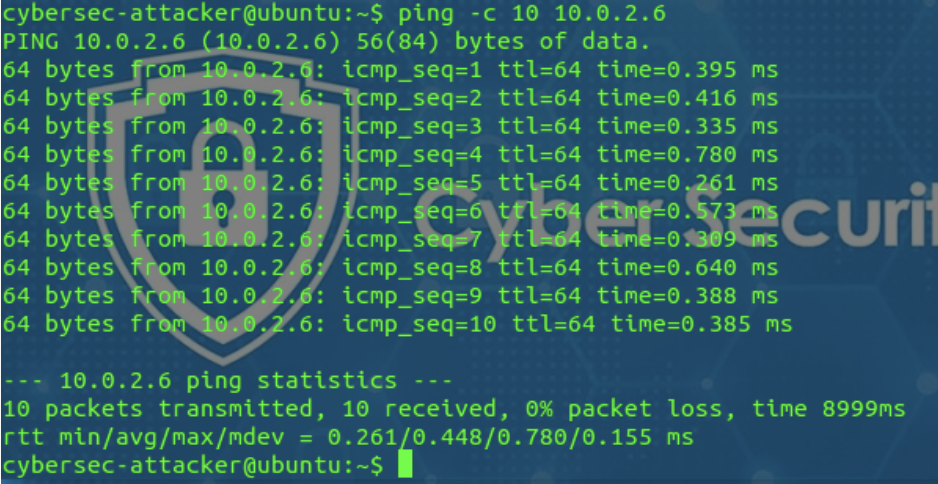
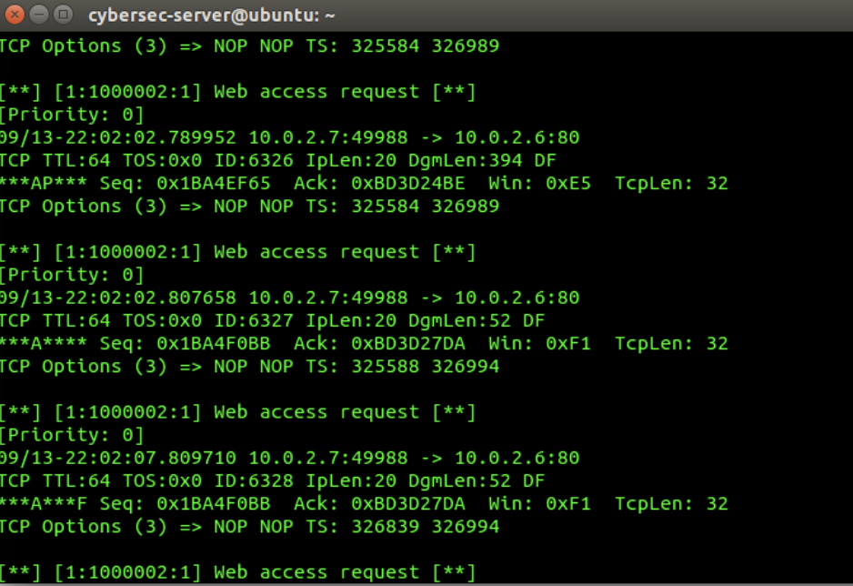
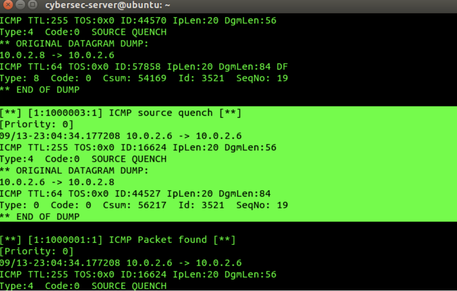
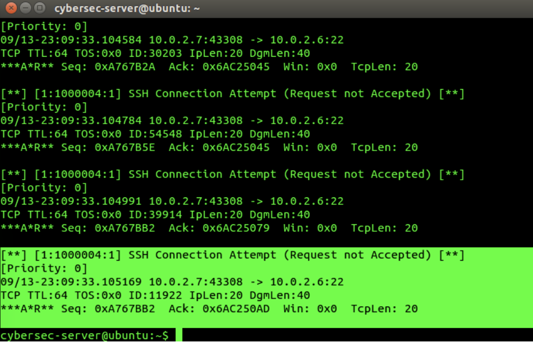
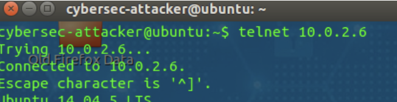
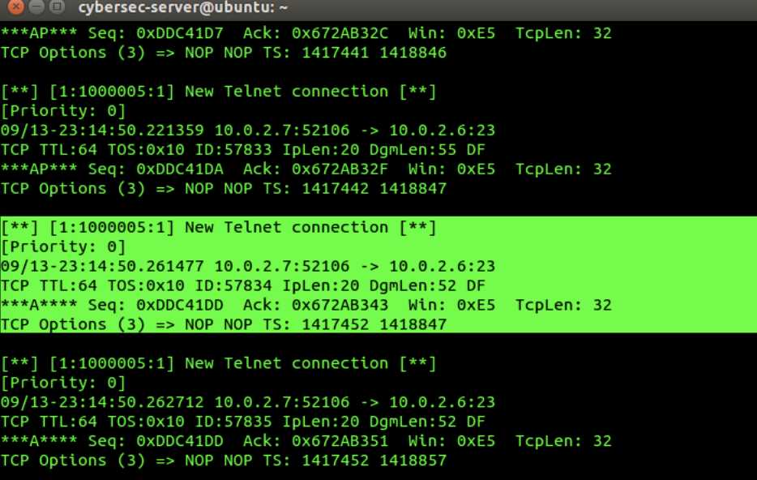
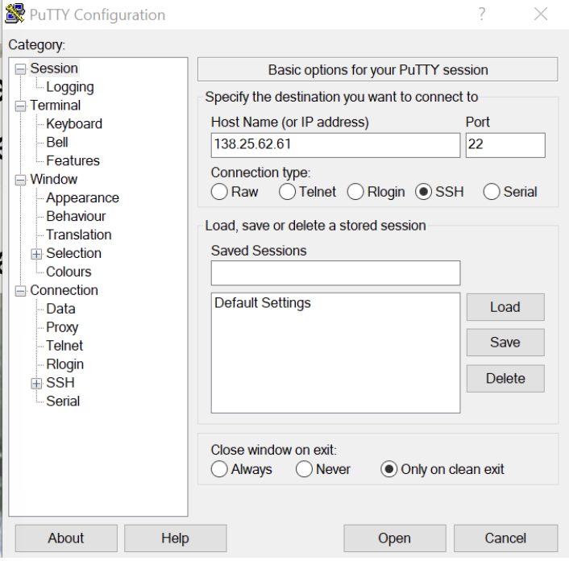
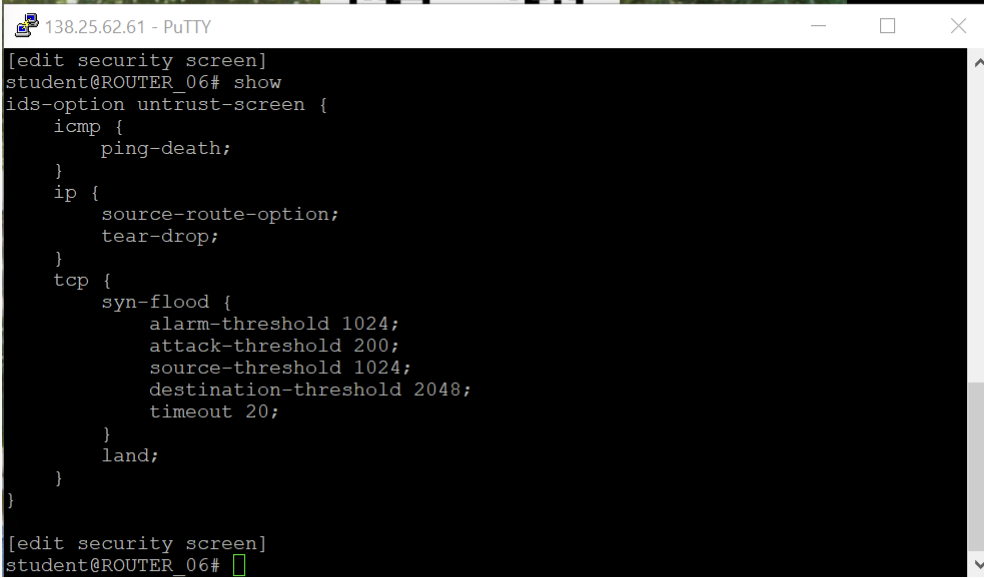
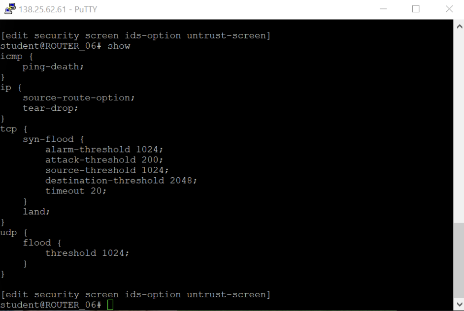
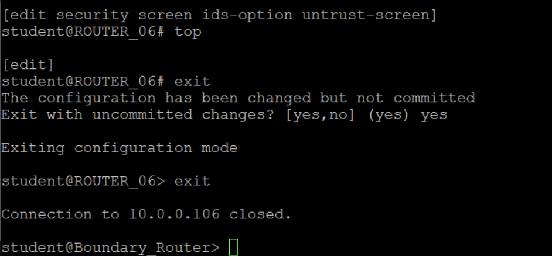

# snort-ids-traffic-detection-lab

## Overview

This project documents a controlled university cybersecurity lab focused on detecting network activity with the Snort Intrusion Detection System (IDS).

The experiments generated ICMP, HTTP, SSH and Telnet traffic in an isolated virtual network. Snort monitored the traffic and produced alerts when packets matched the configured detection rules. The final exercise examined how firewall configuration could be used to interrupt an unauthorized connection.

The purpose of this lab was to understand how network traffic is detected, interpreted and controlled from a defensive security perspective.

> **Ethical Scope:** All traffic generation, monitoring and firewall testing were performed in an isolated and authorized university lab environment. This repository is presented strictly for educational and defensive purposes.

## Lab Objectives

- Configure and operate Snort as a network intrusion detection system.
- Detect ICMP packets moving across the lab network.
- Generate and identify HTTP web-access requests.
- Detect an ICMP Source Quench message.
- Monitor SSH connection attempts.
- Identify new Telnet connections.
- Examine Snort alert information and network indicators.
- Apply firewall controls and verify the resulting connection behavior.

## Tools and Environment 

- Snort IDS
- Linux virtual machines
- VMware
- PuTTY
- Juniper Junos firewall
- Telnet
- SSH
- HTTP utilities
- ICMP utilities

---

## 1. ICMP Packet Detection

### Detection Technique

Internet Control Message Protocol (ICMP) is commonly used for network diagnostics and error reporting. For example, the `ping` utility uses ICMP Echo Request and Echo Reply messages to test whether another host is reachable.

Although ICMP has legitimate purposes, unusual ICMP traffic can also be associated with network reconnaissance, denial-of-service activity or covert communication. Monitoring it can therefore help defenders identify suspicious behavior.

### Starting Snort

Snort was started in console-alert mode on the monitoring system. The appropriate network interface and configuration file were selected so that Snort could inspect traffic moving through the lab network.

**Observation:** Snort loaded its configuration and detection rules before beginning live traffic monitoring.

### Generating ICMP Traffic

A controlled `ping` test was performed between the designated virtual machines to generate ICMP Echo Request and Echo Reply traffic.

**Observation:** The destination responded to the requests, confirming that ICMP traffic was passing through the monitored network.

### Detecting the ICMP Packet

Snort inspected the generated traffic and displayed an alert when the ICMP packet matched the configured detection rule.

**Result:** The alert confirmed that Snort successfully detected the ICMP traffic and displayed relevant network information about the event.

### Security Analysis 

ICMP monitoring can help identify activities such as host discovery, network mapping and abnormal volumes of diagnostic traffic. However, an ICMP alert does not automatically prove that an attack occurred because legitimate administration tools also use the protocol.

Analysts should examine:

- The source and destination IP addresses.
- The ICMP message type and code.
- The number and frequency of alerts.
- Whether the traffic matches expected network activity.
- Whether the same source is generating other suspicious events.

---

## 2. Web-Access Request Detection

### Detection Technique

Web-access traffic is normally generated when a client connects a web server using HTTP or HTTPS. Monitoring these requests can help security analysts identify unexpected connections, suspicious scanning behavior and attempts to access protected services.

### Generating the Web-Access Request

A client system sent a request to the designated web server to produce HTTP traffic for analysis.

**Observation:** The request created traffic between the client and the web service on the monitored network.

### Detecting the Request with Snort

Snort inspected the traffic and displayed an alert when the web-access request matched the configured rule.

**Result:** Snort successfully identified the web request and displayed information associated with the connection.

### Security Analysis

Monitoring web-access requests can help defenders detect unusual connections to internal services. However, ordinary web browsing also produces HTTP traffic, so analysts must examine the context before deciding that an alert represents malicious activity.

Important indicators include:

- The source and destination IP addresses.
- The destination port and network service.
- The frequency of requests from the same source.
- Requests to unexpected or restricted systems.
- Repeated connection attempts across multiple ports.
- Other alerts generated by the same host.

---

## 3. ICMP Source Quench Detection

### Detection Technique

ICMP Source Quench was originally designed to notify a transmitting device that network congestion had ocurred and request that it reduce its transmission rate.

However, Source Quench messages do not provide authentication and could be forged to interfere with network performance. The message type is now obsolete, so its presence on a modern network may warrant investigation.

### Generating and Detecting the Traffic

A controlled ICMP Source Quench packet was generated within the isolated lab network while Snort monitored the traffic.

**Observation:** Snort examined the generated packet and displayed an alert identifying the ICMP Source Quench traffic.

**Result:** The experiment confirmed that Snort could detect this obsolete ICMP message type and provide information about its source and destination.

### Security Analysis

Because ICMP Source Quench is deprecated, it should not normally appear on a modern network. Detection may indicate a legacy or incorrectly configured device, packet-generation testing or potentially malicious activity.

Recommended defensive actions include:

- Configure modern systems to ignore Source Quench messages.
- Monitoring for obsolete or unexpected ICMP message types.
- Investigating the source device responsible for the traffic.
- Applying anti-spoofing controls at network boundaries.
- Coreelating the alert with other network and host activity.
- Keeping operating systems and network devices updated.

---

## 4. SSH Connection Attempt Detection

### Detection Technique

Secure Shell (SSH) is an encrypted protocol commonly used for remote system administration. Although SSH protects transmitted data, unauthorized connection attempts may indicate reconnaissance, credential attacks or attempts to access a protected server.

Monitoring SSH traffic allows security analysts to identify which systems are attempting to access administrative services.

### Generating the SSH Connection Attempt

An SSH connection attempt was generated between the designated virtual machines while Snort monitored the lab network.

**Observation:** Snort detected traffic associated with the SSH connection attempt and displayed the relevant alert information.

**Result:** The experiment demonstrated that Snort could identify an attempt to access the SSH service and record network indicators such as the source address, destination address and service port.

### Security Analysis

An individual SSH connection is not necessarily malicious because administrators commonly use SSH for legitimate remote access. However, repeated or unexpected attempts may indicate suspicious activity.

Security analysts should examine:

- Whether the source IP address is authorized.
- The number and frequency of connection attempts.
- Whether several usernames or credentials were attempted.
- Whether the source attempted to access other services.
- Whether authentication ultimately succeeded or failed.
- Whether the activity occurred at an unusual time.

Potential defensive measures include:

- Restricting SSH access to trusted IP addresses.
- Requiring key-based authentication.
- Disabling direct root login.
- Using multi-factor authentication where available.
- Monitoring repeated authentication failures.
- Blocking sources that demonstrate automated or malicious behavior.

---

## 5. Telnet Connection Detection

### Detection Technique

Telnet is a remote-access protocol that transmits usernames, passwords and commands without encryption. This makes Telnet unsuitable for secure system administration because anyone able to observe the network traffic may be able to view sensitive session information.

Monitoring Telnet traffic allows defenders to detect insecure remote-access activity and identify unexpected connections to TCP port 23.

### Establishing the Telnet Connection

A Telnet connection was initiated between the designated virtual machines to generate traffic for Snort analysis.

**Observation:** The client successfully established a Telnet session with the destination system.

### Detecting the Connection with Snort

Snort inspected the network traffic and generated an alert for the new Telnet connection.

**Result:** Snort successfully detected the Telnet connection and displayed information about the source, destination and network service.

### Security Analysis

The presence of Telnet traffic represents a security concern because the protocol does not protect transmitted credentials or commands. A Telnet alert should therefore be investigated to determine whether the connection was authorized and why an insecure protocol was being used.

Potential defensive measures include:

- Disabling the Telnet service.
- Replacing Telnet with SSH.
- Blocking TCP port 23 at network boundaries.
- Restricting remote administration to trusted devices.
- Monitoring all attempts to establish Telnet connections.
- Investigating systems that continue to use legacy protocols.
- Using network segmentation to protect administrative services.

---

## 6. Firewall Configuration and Connection Validation

### Defensive Technique

Snort provides visibility by detecting and alerting on suspicious network traffic. A firewall complements this detection capability by enforcing access-control rules and preventing or terminating prohibited connections.

In this part of the lab, PuTTY was used to access the firewall, review its security configuration and test the resulting connection behavior.

### Connecting to the Firewall

PuTTY was configured to establish a management connection to the designated firewall in the isolated lab network.

**Observation:** The configuration identified the firewall management address and the connection method used to access its command-line interface.

### Reviewing the Firewall Screen Configuration

The firewall configuration was examined through the command-line interface. The configured screen and security settings determine how the firewall handles selected network traffic.

**Observation:** The command output displayed the configured security-screen settings associated with the relevant network zone.

### Verifying the Configuration

A verification command was used to confirm that the intended firewall configuration was present.

**Result:** The displayed configuration confirmed that the security settings had been applied to the firewall.

### Testing the Connection

A new connection attempt was performed after the firewall configuration hand been applied.

**Result:** The connection was closed, demonstrating that the fiewall could enforce the configured security policy and affect unauthorized or prohibited traffic.

### Security Analysis

This exercise demonstrates the complementary roles of intrusion detection and firewall enforcement:

- Snort observes traffic and generates alerts.
- Security analysts interpret the alerts and determine the risk.
- Firewalls enforce rules that permit, reject or drop traffic.
- Verification commands confirm that the intended configuration is active.
- Connection testing demonstrates whether the control works as expected.

Combining IDS monitoring with firewall controls provides stronger protection than relying on either technology alone. Detection supplies visibility, while firewall enforcement helps prevent suspicious traffic from reaching protected systems.

Recommended practices include:

- Applying least-privilege access-control rules.
- Reviewing firwall configurations regularly.
- Testing security rules after implmentation.
- Monitoring blocked and terminated connections.
- Correlating Snort alerts with firewall logs.
- Removing unnecessary or outdated firewall rules.
- Documenting all authorized configuration changes.
