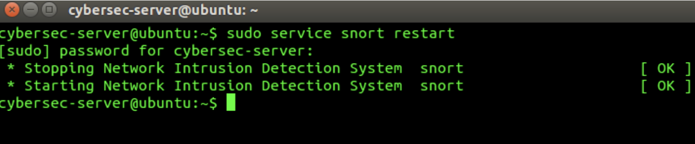
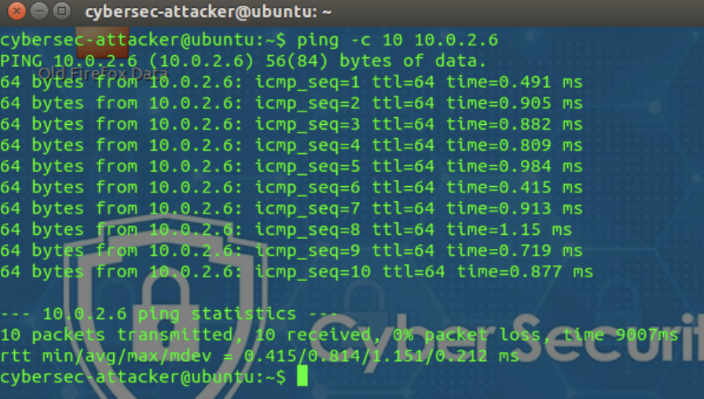
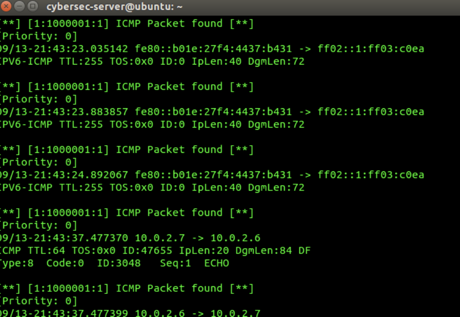

# snort-ids-traffic-detection-lab

## Overview

This project documents a controlled university cybersecurity lab focused on detecting network activity with the Snort Intrusion Detection System (IDS).

The experiments generated ICMP, HTTP, SSH and Telnet traffic in an isolated virtual network. Snort monitored the traffic and produced alerts when packets matched the configured detection rules. The final exercise examined how firewall configuration could be used to interrupt an unauthorized connection.

The purpose of this lab was to understand how network traffic is detected, interpreted and controlled from a defensive security perspective.

> **Ethical Scope:** All traffic generation, monitoring and firewall testing were performed in an isolated and authorized university lab environment. This repository is presented strictly for educational and defensive purposes.

## Lab Objectives

- Configure and operate Snort as a network intrusion detection system.
- Detect ICMP packets moving across the lab network.
- Generate and identify HTTP web-access requests.
- Detect an ICMP Source Quench message.
- Monitor SSH connection attempts.
- Identify new Telnet connections.
- Examine Snort alert information and network indicators.
- Apply firewall controls and verify the resulting connection behavior.

## Tools and Environment 

- Snort IDS
- Linux virtual machines
- VMware
- PuTTY
- Juniper Junos firewall
- Telnet
- SSH
- HTTP utilities
- ICMP utilities

---

## 1. ICMP Packet Detection

### Detection Technique

Internet Control Message Protocol (ICMP) is commonly used for network diagnostics and error reporting. For example, the `ping` utility uses ICMP Echo Request and Echo Reply messages to test whether another host is reachable.

Although ICMP has legitimate purposes, unusual ICMP traffic can also be associated with network reconnaissance, denial-of-service activity or covert communication. Monitoring it can therefore help defenders identify suspicious behavior.

### Starting Snort

Snort was started in console-alert mode on the monitoring system. The appropriate network interface and configuration file were selected so that Snort could inspect traffic moving through the lab network.

**Observation:** Snort loaded its configuration and detection rules before beginning live traffic monitoring.

### Generating ICMP Traffic

A controlled `ping` test was performed between the designated virtual machines to generate ICMP Echo Request and Echo Reply traffic.

**Observation:** The destination responded to the requests, confirming that ICMP traffic was passing through the monitored network.

### Detecting the ICMP Packet

Snort inspected the generated traffic and displayed an alert when the ICMP packet matched the configured detection rule.

**Result:** The alert confirmed that Snort successfully detected the ICMP traffic and displayed relevant network information about the event.

### Security Analysis 

ICMP monitoring can help identify activities such as host discovery, network mapping and abnormal volumes of diagnostic traffic. However, an ICMP alert does not automatically prove that an attack occurred because legitimate administration tools also use the protocol.

Analysts should examine:

- The source and destination IP addresses.
- The ICMP message type and code.
- The number and frequency of alerts.
- Whether the traffic matches expected network activity.
- Whether the same source is generating other suspicious events.

  

